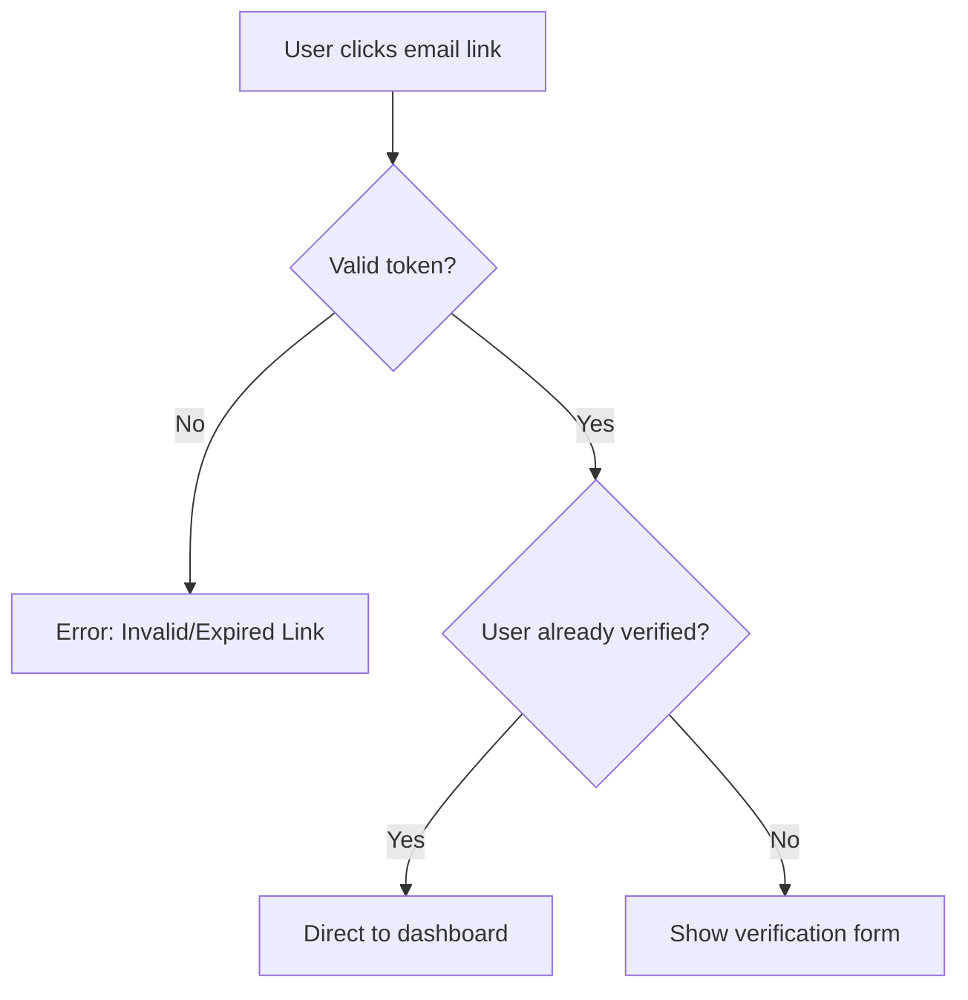
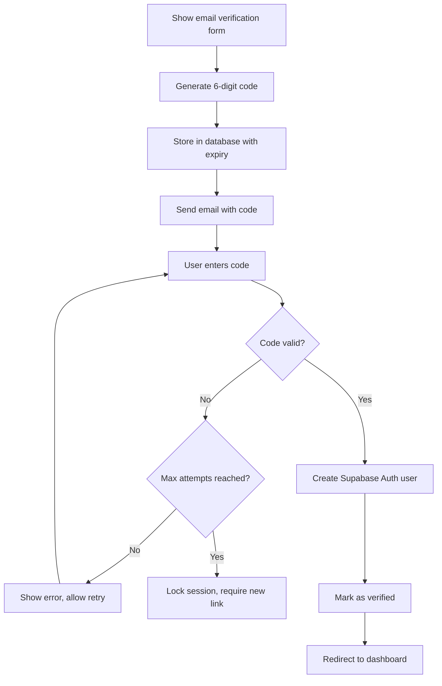

# Loan Status Verification System - Implementation Plan

## Overview

This document outlines the comprehensive implementation plan for a secure email-based verification system that allows loan applicants to access their application status through a Next.js 15 application integrated with Supabase Auth.

## System Architecture

### High-Level Flow

1. **Loan Application Completion** → Other Next.js app sends status link via email
2. **First-Time Access** → User clicks link, system detects new user
3. **Email Verification** → 6-digit code sent to email address
4. **Code Validation** → User enters code to verify email ownership
5. **Access Granted** → Redirect to dashboard showing loan status
6. **Session Management** → Subsequent visits bypass verification

## Technical Requirements

### Current Tech Stack Analysis

- **Framework**: Next.js 15 with Turbopack
- **Database**: Supabase (fcu-forms project)
- **Authentication**: Supabase Auth
- **Styling**: Tailwind CSS v4
- **Type Safety**: TypeScript 5

### Existing Database Schema

Based on analysis of your `api` schema:

#### Available Tables

- `tblLoanApplication` - Main loan application data (41 columns)
- `tblLoanApplicationStatusMaster` - Status lookup table

#### Key Status Codes (Portal Visible)

- `INIT` - Application Started
- `DRAFT` - Draft Application
- `RCVD` - Application Received
- `ASGN` - Application Assigned
- `SOVSUB` - Application Submitted to G3

## Database Schema Design

### New Tables Required

#### 1. `user_verification_sessions`

```sql
CREATE TABLE api.user_verification_sessions (
    id UUID PRIMARY KEY DEFAULT gen_random_uuid(),
    email TEXT NOT NULL,
    loan_application_number BIGINT NOT NULL,
    verification_code TEXT NOT NULL,
    code_expires_at TIMESTAMPTZ NOT NULL,
    is_verified BOOLEAN DEFAULT FALSE,
    attempts_count INTEGER DEFAULT 0,
    max_attempts INTEGER DEFAULT 3,
    created_at TIMESTAMPTZ DEFAULT NOW(),
    verified_at TIMESTAMPTZ,
    ip_address INET,
    user_agent TEXT,

    -- Foreign key to loan application
    CONSTRAINT fk_loan_application
        FOREIGN KEY (loan_application_number)
        REFERENCES api.tblLoanApplication(Lnd_application_number),

    -- Ensure one active session per email/loan combo
    CONSTRAINT unique_active_session
        UNIQUE (email, loan_application_number, is_verified)
        WHERE is_verified = FALSE
);

-- Indexes for performance
CREATE INDEX idx_verification_email ON api.user_verification_sessions(email);
CREATE INDEX idx_verification_loan ON api.user_verification_sessions(loan_application_number);
CREATE INDEX idx_verification_code ON api.user_verification_sessions(verification_code);
CREATE INDEX idx_verification_expires ON api.user_verification_sessions(code_expires_at);
```

#### 2. `user_access_logs`

```sql
CREATE TABLE api.user_access_logs (
    id UUID PRIMARY KEY DEFAULT gen_random_uuid(),
    email TEXT NOT NULL,
    loan_application_number BIGINT NOT NULL,
    access_type TEXT NOT NULL, -- 'verification_request', 'verification_success', 'verification_failed', 'dashboard_access'
    ip_address INET,
    user_agent TEXT,
    session_id UUID,
    created_at TIMESTAMPTZ DEFAULT NOW(),
    additional_data JSONB,

    -- Foreign key to loan application
    CONSTRAINT fk_loan_application_log
        FOREIGN KEY (loan_application_number)
        REFERENCES api.tblLoanApplication(Lnd_application_number)
);

-- Indexes for performance and analytics
CREATE INDEX idx_access_email ON api.user_access_logs(email);
CREATE INDEX idx_access_loan ON api.user_access_logs(loan_application_number);
CREATE INDEX idx_access_type ON api.user_access_logs(access_type);
CREATE INDEX idx_access_date ON api.user_access_logs(created_at);
```

#### 3. `verified_users`

```sql
CREATE TABLE api.verified_users (
    id UUID PRIMARY KEY DEFAULT gen_random_uuid(),
    email TEXT NOT NULL,
    loan_application_number BIGINT NOT NULL,
    supabase_user_id UUID, -- Link to Supabase Auth user
    first_verified_at TIMESTAMPTZ NOT NULL DEFAULT NOW(),
    last_access_at TIMESTAMPTZ DEFAULT NOW(),
    access_count INTEGER DEFAULT 1,
    is_active BOOLEAN DEFAULT TRUE,

    -- Foreign key to loan application
    CONSTRAINT fk_loan_application_verified
        FOREIGN KEY (loan_application_number)
        REFERENCES api.tblLoanApplication(Lnd_application_number),

    -- Unique constraint
    CONSTRAINT unique_verified_user
        UNIQUE (email, loan_application_number)
);

-- Indexes
CREATE INDEX idx_verified_email ON api.verified_users(email);
CREATE INDEX idx_verified_loan ON api.verified_users(loan_application_number);
CREATE INDEX idx_verified_supabase_user ON api.verified_users(supabase_user_id);
```

## Authentication Flow Design

### URL Structure

```
https://yourdomain.com/verify?token=<encrypted_payload>

Encrypted payload contains:
{
  "email": "user@example.com",
  "loanApplicationNumber": 123456,
  "timestamp": "2024-01-01T00:00:00Z",
  "signature": "hash_for_integrity"
}
```

### Step-by-Step User Journey

#### 1. Initial Access



#### 2. Verification Process



## Security Considerations

### 1. Rate Limiting

- **Email sending**: Max 3 verification emails per hour per email address
- **Code attempts**: Max 3 attempts per verification session
- **IP-based limiting**: Max 10 verification attempts per IP per hour

### 2. Code Security

- **Format**: 6-digit numeric code (000000-999999)
- **Expiry**: 10 minutes from generation
- **Uniqueness**: Ensure no duplicate active codes
- **Hashing**: Store hashed codes in the database

### 3. Token Security

- **Encryption**: AES-256 encryption for URL tokens
- **Expiry**: 24-hour token validity
- **Signature**: HMAC signature to prevent tampering
- **Single-use**: Tokens become invalid after successful verification

### 4. Session Management

- **Supabase Auth**: Leverage built-in session management
- **JWT tokens**: Secure API access
- **Refresh tokens**: Handle long-term access

## Implementation Components

### 1. Middleware (`middleware.ts`)

```typescript
// Route protection and token validation
// Redirect logic for verified/unverified users
// Rate limiting enforcement
```

### 2. API Routes

#### `/api/auth/verify-email`

- Validate incoming token
- Generate and send 6-digit code
- Log verification request

#### `/api/auth/verify-code`

- Validate 6-digit code
- Create Supabase Auth user
- Update verification status
- Log verification result

#### `/api/auth/resend-code`

- Resend verification code (with rate limiting)
- Update expiry time

### 3. Pages/Components

#### `/verify` - Verification Page

- Token validation
- Email display (masked)
- Code input form
- Resend functionality
- Error handling

#### `/dashboard` - Status Dashboard

- Protected route
- Loan status display
- Real-time updates
- Logout functionality

### 4. Utilities

#### Email Service

- Integration with email provider (SendGrid/Resend)
- Template management
- Delivery tracking

#### Encryption/Decryption

- Token generation and validation
- Code hashing utilities

## Database Functions and Triggers

### 1. Code Generation Function

```sql
CREATE OR REPLACE FUNCTION generate_verification_code()
RETURNS TEXT AS $$
BEGIN
    RETURN LPAD(FLOOR(RANDOM() * 1000000)::TEXT, 6, '0');
END;
$$ LANGUAGE plpgsql;
```

### 2. Cleanup Function

```sql
CREATE OR REPLACE FUNCTION cleanup_expired_sessions()
RETURNS INTEGER AS $$
DECLARE
    deleted_count INTEGER;
BEGIN
    DELETE FROM api.user_verification_sessions
    WHERE code_expires_at < NOW() AND is_verified = FALSE;

    GET DIAGNOSTICS deleted_count = ROW_COUNT;
    RETURN deleted_count;
END;
$$ LANGUAGE plpgsql;
```

### 3. Scheduled Cleanup (via pg_cron or external cron)

```sql
-- Run every hour to cleanup expired sessions
SELECT cleanup_expired_sessions();
```

## Row Level Security (RLS) Policies

### `user_verification_sessions`

```sql
ALTER TABLE api.user_verification_sessions ENABLE ROW LEVEL SECURITY;

-- System can manage verification sessions (using anon role for consistency)
CREATE POLICY "System can insert verification sessions" ON api.user_verification_sessions
    FOR INSERT TO anon WITH CHECK (true);

CREATE POLICY "System can update verification sessions" ON api.user_verification_sessions
    FOR UPDATE TO anon USING (true);

-- Users can only see their own verification sessions
CREATE POLICY "Users can read own verification sessions" ON api.user_verification_sessions
    FOR SELECT TO anon USING (
        (auth.jwt() ->> 'email') = email OR
        auth.uid()::text IN (
            SELECT supabase_user_id::text
            FROM api.verified_users
            WHERE verified_users.email = user_verification_sessions.email
        )
    );
```

### `verified_users`

```sql
ALTER TABLE api.verified_users ENABLE ROW LEVEL SECURITY;

-- System can manage verified users (using anon role for consistency)
CREATE POLICY "System can insert verified users" ON api.verified_users
    FOR INSERT TO anon WITH CHECK (true);

CREATE POLICY "System can update verified users" ON api.verified_users
    FOR UPDATE TO anon USING (true);

-- Users can only see their own verification status
CREATE POLICY "Users can read own verified user record" ON api.verified_users
    FOR SELECT TO anon USING (
        (auth.jwt() ->> 'email') = email OR
        auth.uid() = supabase_user_id
    );
```

## Environment Variables

```env
# Supabase
NEXT_PUBLIC_SUPABASE_URL=your_supabase_url
NEXT_PUBLIC_SUPABASE_ANON_KEY=your_anon_key
SUPABASE_SERVICE_ROLE_KEY=your_service_role_key

# Email Service
EMAIL_PROVIDER=sendgrid # or resend
SENDGRID_API_KEY=your_sendgrid_key
EMAIL_FROM=noreply@yourdomain.com

# Security
JWT_SECRET=your_jwt_secret_for_tokens
ENCRYPTION_KEY=your_32_char_encryption_key
VERIFICATION_CODE_EXPIRY_MINUTES=10
TOKEN_EXPIRY_HOURS=24

# Rate Limiting
MAX_EMAIL_REQUESTS_PER_HOUR=3
MAX_CODE_ATTEMPTS=3
MAX_IP_ATTEMPTS_PER_HOUR=10
```

## Error Handling & Edge Cases

### 1. Invalid/Expired Tokens

- Display user-friendly error message
- Provide contact information for support
- Log security events

### 2. Email Delivery Failures

- Retry mechanism with exponential backoff
- Alternative contact methods
- Support escalation

### 3. Database Connection Issues

- Graceful degradation
- Cached responses where possible
- User notification of temporary issues

### 4. Concurrent Access

- Handle multiple browser sessions
- Prevent code reuse across sessions
- Session conflict resolution

## Testing Strategy

### 1. Unit Tests

- Token generation/validation
- Code generation/verification
- Database operations
- Email service integration

### 2. Integration Tests

- Complete verification flow
- Error scenarios
- Rate limiting
- Security boundaries

### 3. Security Testing

- Token manipulation attempts
- Rate limiting bypass attempts
- SQL injection prevention
- XSS prevention

## Monitoring & Analytics

### 1. Key Metrics

- Verification success rate
- Average time to verify
- Failed verification attempts
- Email delivery rates
- User engagement post-verification

### 2. Alerting

- High failure rates
- Suspicious activity patterns
- Email delivery issues
- Database performance issues

### 3. Logging

- All verification attempts
- Security events
- Performance metrics
- User journey tracking

## Deployment Considerations

### 1. Vercel Configuration

```json
{
  "functions": {
    "app/api/auth/verify-email/route.ts": {
      "maxDuration": 30
    },
    "app/api/auth/verify-code/route.ts": {
      "maxDuration": 30
    }
  }
}
```

### 2. Database Migration Strategy

- Run migrations in staging first
- Backup existing data
- Rollback plan
- Performance impact assessment

### 3. Feature Flags

- Gradual rollout capability
- A/B testing for UX improvements
- Emergency disable switches

## Future Enhancements

### 1. Multi-Factor Authentication

- SMS verification option
- Authenticator app support
- Biometric authentication

### 2. Advanced Security

- Device fingerprinting
- Behavioral analysis
- Geographic restrictions

### 3. User Experience

- Progressive web app features
- Push notifications
- Offline capability

### 4. Analytics Dashboard

- Admin panel for verification metrics
- User behavior insights
- Security monitoring dashboard

## Implementation Timeline

### Phase 1: Core Infrastructure (Week 1-2)

- Database schema creation
- Basic API routes
- Token system implementation

### Phase 2: Verification Flow (Week 2-3)

- Email verification system
- Code validation
- User interface development

### Phase 3: Security & Testing (Week 3-4)

- Rate limiting implementation
- Security testing
- Performance optimization

### Phase 4: Dashboard Integration (Week 4-5)

- Status dashboard development
- Real-time updates
- User experience refinement

### Phase 5: Deployment & Monitoring (Week 5-6)

- Production deployment
- Monitoring setup
- Documentation completion

## Advanced Security Implementation

### 15-Minute Session Timeout Policy

#### Session Management Strategy

After the first successful login, all subsequent logins must be limited to 15-minute sessions to minimize security exposure:

#### Supabase Auth Configuration

```typescript
// supabase/config.ts
export const supabaseConfig = {
  auth: {
    // Set JWT expiry to 15 minutes (900 seconds)
    persistSession: true,
    detectSessionInUrl: true,
    autoRefreshToken: false, // Disable auto-refresh to enforce 15-min limit
    storage: new ExpireStorage(), // Custom storage with auto-expiry
  },
  global: {
    headers: {
      'X-Client-Info': 'loan-status-app@1.0.0',
    },
  },
}
```

#### Custom Expiring Storage Implementation

```typescript
// lib/expire-storage.ts
class ExpireStorage {
  private static readonly SESSION_DURATION_MINUTES = 15
  private static readonly STORAGE_KEY_PREFIX = 'sb-auth-'

  static async getItem(key: string): Promise<string | null> {
    try {
      const rawData = localStorage.getItem(key)
      if (!rawData) return null

      const data = JSON.parse(rawData)

      // Check if session has expired
      if (data.expireAt && new Date(data.expireAt) < new Date()) {
        await this.removeItem(key)
        // Trigger session expired event
        window.dispatchEvent(new CustomEvent('session-expired'))
        return null
      }

      return data.value
    } catch (error) {
      console.error('Error reading from storage:', error)
      return null
    }
  }

  static async setItem(key: string, value: string): Promise<void> {
    try {
      const expireAt = new Date()
      expireAt.setMinutes(expireAt.getMinutes() + this.SESSION_DURATION_MINUTES)

      const data = {
        value,
        expireAt: expireAt.toISOString(),
        createdAt: new Date().toISOString(),
      }

      localStorage.setItem(key, JSON.stringify(data))
    } catch (error) {
      console.error('Error writing to storage:', error)
    }
  }

  static async removeItem(key: string): Promise<void> {
    localStorage.removeItem(key)
  }
}
```

#### Session Monitoring Middleware

```typescript
// middleware.ts
import { createMiddlewareClient } from '@supabase/auth-helpers-nextjs'
import { NextResponse } from 'next/server'
import type { NextRequest } from 'next/server'

export async function middleware(req: NextRequest) {
  const res = NextResponse.next()
  const supabase = createMiddlewareClient({ req, res })

  // Check session validity
  const {
    data: { session },
    error,
  } = await supabase.auth.getSession()

  if (error || !session) {
    // Redirect to verification page
    return NextResponse.redirect(new URL('/verify', req.url))
  }

  // Check if session is within 15-minute window
  const sessionAge = Date.now() - new Date(session.created_at).getTime()
  const fifteenMinutes = 15 * 60 * 1000

  if (sessionAge > fifteenMinutes) {
    // Force logout and redirect
    await supabase.auth.signOut()
    return NextResponse.redirect(new URL('/verify?expired=true', req.url))
  }

  return res
}

export const config = {
  matcher: ['/dashboard/:path*', '/api/protected/:path*'],
}
```

### Comprehensive Attack Prevention

#### 1. CSRF Protection Implementation

##### CSRF Token Generation and Validation

```typescript
// lib/csrf.ts
import { randomBytes, createHmac } from 'crypto'

export class CSRFProtection {
  private static readonly SECRET = process.env.CSRF_SECRET!
  private static readonly TOKEN_LENGTH = 32

  static generateToken(sessionId: string): string {
    const randomToken = randomBytes(this.TOKEN_LENGTH).toString('hex')
    const timestamp = Date.now().toString()
    const payload = `${randomToken}:${timestamp}:${sessionId}`
    const signature = createHmac('sha256', this.SECRET)
      .update(payload)
      .digest('hex')

    return Buffer.from(`${payload}:${signature}`).toString('base64')
  }

  static validateToken(token: string, sessionId: string): boolean {
    try {
      const decoded = Buffer.from(token, 'base64').toString()
      const [randomToken, timestamp, providedSessionId, signature] =
        decoded.split(':')

      // Verify session ID matches
      if (providedSessionId !== sessionId) return false

      // Check token age (max 1 hour)
      const tokenAge = Date.now() - parseInt(timestamp)
      if (tokenAge > 3600000) return false // 1 hour

      // Verify signature
      const payload = `${randomToken}:${timestamp}:${sessionId}`
      const expectedSignature = createHmac('sha256', this.SECRET)
        .update(payload)
        .digest('hex')

      return signature === expectedSignature
    } catch {
      return false
    }
  }
}
```

##### CSRF Middleware for API Routes

```typescript
// lib/csrf-middleware.ts
import { NextRequest } from 'next/server'
import { CSRFProtection } from './csrf'

export async function validateCSRF(req: NextRequest): Promise<boolean> {
  if (req.method === 'GET' || req.method === 'HEAD') return true

  const csrfToken =
    req.headers.get('X-CSRF-Token') || req.headers.get('x-csrf-token')
  const sessionId = req.cookies.get('session-id')?.value

  if (!csrfToken || !sessionId) return false

  return CSRFProtection.validateToken(csrfToken, sessionId)
}
```

#### 2. XSS Prevention Measures

##### Content Security Policy Configuration

```typescript
// next.config.ts
const nextConfig = {
  async headers() {
    return [
      {
        source: '/(.*)',
        headers: [
          {
            key: 'Content-Security-Policy',
            value: [
              "default-src 'self'",
              "script-src 'self' 'unsafe-inline' https://js.stripe.com",
              "style-src 'self' 'unsafe-inline' https://fonts.googleapis.com",
              "font-src 'self' https://fonts.gstatic.com",
              "img-src 'self' data: https:",
              "connect-src 'self' https://*.supabase.co wss://*.supabase.co",
              "frame-src 'none'",
              "object-src 'none'",
              "base-uri 'self'",
              "form-action 'self'",
              "frame-ancestors 'none'",
            ].join('; '),
          },
          {
            key: 'X-Frame-Options',
            value: 'DENY',
          },
          {
            key: 'X-Content-Type-Options',
            value: 'nosniff',
          },
          {
            key: 'Referrer-Policy',
            value: 'strict-origin-when-cross-origin',
          },
          {
            key: 'Permissions-Policy',
            value: 'geolocation=(), microphone=(), camera=()',
          },
        ],
      },
    ]
  },
}
```

##### Input Sanitization Utilities

```typescript
// lib/sanitization.ts
import DOMPurify from 'isomorphic-dompurify'

export class InputSanitizer {
  static sanitizeHtml(input: string): string {
    return DOMPurify.sanitize(input, {
      ALLOWED_TAGS: [], // No HTML tags allowed
      ALLOWED_ATTR: [],
    })
  }

  static sanitizeEmail(email: string): string {
    const emailRegex = /^[^\s@]+@[^\s@]+\.[^\s@]+$/
    const sanitized = email.trim().toLowerCase()
    return emailRegex.test(sanitized) ? sanitized : ''
  }

  static sanitizeLoanNumber(loanNumber: string): string {
    // Only allow alphanumeric characters
    return loanNumber.replace(/[^a-zA-Z0-9]/g, '')
  }
}
```

#### 3. Advanced Rate Limiting

##### Multi-Layer Rate Limiting Strategy

```typescript
// lib/rate-limiting.ts
import { Ratelimit } from '@upstash/ratelimit'
import { Redis } from '@upstash/redis'

const redis = new Redis({
  url: process.env.UPSTASH_REDIS_REST_URL!,
  token: process.env.UPSTASH_REDIS_REST_TOKEN!,
})

export const rateLimiters = {
  // Email verification requests
  emailVerification: new Ratelimit({
    redis,
    limiter: Ratelimit.slidingWindow(3, '1 h'), // 3 per hour
    analytics: true,
  }),

  // Code verification attempts
  codeVerification: new Ratelimit({
    redis,
    limiter: Ratelimit.fixedWindow(5, '15 m'), // 5 per 15 minutes
    analytics: true,
  }),

  // General API requests
  apiRequests: new Ratelimit({
    redis,
    limiter: Ratelimit.slidingWindow(100, '1 m'), // 100 per minute
    analytics: true,
  }),

  // Suspicious activity (failed attempts)
  suspiciousActivity: new Ratelimit({
    redis,
    limiter: Ratelimit.fixedWindow(10, '1 h'), // 10 failed attempts per hour
    analytics: true,
  }),
}

export async function checkRateLimit(
  type: keyof typeof rateLimiters,
  identifier: string
): Promise<{ success: boolean; remaining: number; reset: Date }> {
  const ratelimit = rateLimiters[type]
  const result = await ratelimit.limit(identifier)

  return {
    success: result.success,
    remaining: result.remaining,
    reset: new Date(result.reset),
  }
}
```

##### IP-based and User-based Rate Limiting

```typescript
// lib/advanced-rate-limiting.ts
export class AdvancedRateLimit {
  static async checkMultiLayerLimit(
    req: NextRequest,
    action: string
  ): Promise<{ allowed: boolean; reason?: string }> {
    const ip = this.getClientIP(req)
    const email = req.headers.get('x-user-email')
    const userAgent = req.headers.get('user-agent')

    // Check IP-based rate limit
    const ipLimit = await checkRateLimit('apiRequests', ip)
    if (!ipLimit.success) {
      return { allowed: false, reason: 'IP rate limit exceeded' }
    }

    // Check user-based rate limit if email provided
    if (email) {
      const userLimit = await checkRateLimit('emailVerification', email)
      if (!userLimit.success) {
        return { allowed: false, reason: 'User rate limit exceeded' }
      }
    }

    // Check for suspicious patterns
    const suspiciousScore = await this.calculateSuspiciousScore(ip, userAgent)
    if (suspiciousScore > 80) {
      return { allowed: false, reason: 'Suspicious activity detected' }
    }

    return { allowed: true }
  }

  private static getClientIP(req: NextRequest): string {
    const forwarded = req.headers.get('x-forwarded-for')
    const realIP = req.headers.get('x-real-ip')

    if (forwarded) {
      return forwarded.split(',')[0].trim()
    }

    return realIP || req.ip || 'unknown'
  }

  private static async calculateSuspiciousScore(
    ip: string,
    userAgent?: string
  ): Promise<number> {
    let score = 0

    // Check for common bot user agents
    if (userAgent) {
      const botPatterns = ['bot', 'crawler', 'spider', 'scraper']
      if (
        botPatterns.some((pattern) => userAgent.toLowerCase().includes(pattern))
      ) {
        score += 50
      }
    }

    // Check recent failed attempts from this IP
    const recentFailures = await redis.get(`failures:${ip}`)
    if (recentFailures && parseInt(recentFailures as string) > 5) {
      score += 30
    }

    return score
  }
}
```

#### 4. Session Fixation Prevention

##### Secure Session Management

```typescript
// lib/session-security.ts
export class SessionSecurity {
  static async regenerateSessionId(
    supabase: SupabaseClient,
    oldSessionId: string
  ): Promise<string> {
    // Invalidate old session
    await supabase.auth.signOut()

    // Generate new session ID
    const newSessionId = randomBytes(32).toString('hex')

    // Log session regeneration
    await this.logSecurityEvent('session_regenerated', {
      oldSessionId,
      newSessionId,
      timestamp: new Date().toISOString(),
    })

    return newSessionId
  }

  static async detectSessionHijacking(
    sessionId: string,
    currentIP: string,
    currentUserAgent: string
  ): Promise<boolean> {
    const sessionData = await redis.hgetall(`session:${sessionId}`)

    if (!sessionData) return false

    // Check for IP address changes
    if (sessionData.ip && sessionData.ip !== currentIP) {
      await this.logSecurityEvent('suspicious_ip_change', {
        sessionId,
        originalIP: sessionData.ip,
        newIP: currentIP,
      })
      return true
    }

    // Check for significant user agent changes
    if (
      sessionData.userAgent &&
      this.calculateUserAgentSimilarity(
        sessionData.userAgent,
        currentUserAgent
      ) < 0.8
    ) {
      await this.logSecurityEvent('suspicious_user_agent_change', {
        sessionId,
        originalUserAgent: sessionData.userAgent,
        newUserAgent: currentUserAgent,
      })
      return true
    }

    return false
  }

  private static calculateUserAgentSimilarity(
    ua1: string,
    ua2: string
  ): number {
    // Simple Jaccard similarity
    const set1 = new Set(ua1.toLowerCase().split(' '))
    const set2 = new Set(ua2.toLowerCase().split(' '))

    const intersection = new Set([...set1].filter((x) => set2.has(x)))
    const union = new Set([...set1, ...set2])

    return intersection.size / union.size
  }

  private static async logSecurityEvent(
    eventType: string,
    data: Record<string, any>
  ): Promise<void> {
    // Log to database and external monitoring service
    const logEntry = {
      event_type: eventType,
      data,
      timestamp: new Date().toISOString(),
      severity: 'HIGH',
    }

    // Store in database
    await supabase.from('security_logs').insert(logEntry)

    // Send to monitoring service (e.g., Sentry, DataDog)
    console.warn('Security Event:', logEntry)
  }
}
```

### Security Monitoring & Alerting

#### Real-time Security Monitoring

```typescript
// lib/security-monitoring.ts
export class SecurityMonitoring {
  static async initializeMonitoring(): Promise<void> {
    // Set up real-time listeners for security events
    this.setupFailedLoginMonitoring()
    this.setupSuspiciousActivityDetection()
    this.setupSessionAnomalyDetection()
  }

  private static setupFailedLoginMonitoring(): void {
    // Monitor failed verification attempts
    supabase
      .channel('security-events')
      .on(
        'postgres_changes',
        {
          event: 'INSERT',
          schema: 'api',
          table: 'user_access_logs',
          filter: 'access_type=eq.verification_failed',
        },
        (payload) => {
          this.handleFailedLogin(payload.new)
        }
      )
      .subscribe()
  }

  private static async handleFailedLogin(logEntry: any): Promise<void> {
    const { email, ip_address } = logEntry

    // Count recent failures
    const recentFailures = await this.countRecentFailures(email, ip_address)

    if (recentFailures >= 5) {
      // Trigger security alert
      await this.triggerSecurityAlert('MULTIPLE_FAILED_LOGINS', {
        email,
        ip_address,
        failure_count: recentFailures,
        time_window: '1 hour',
      })

      // Temporarily block IP
      await this.blockIP(ip_address, 3600) // 1 hour block
    }
  }

  private static async triggerSecurityAlert(
    alertType: string,
    data: Record<string, any>
  ): Promise<void> {
    // Send to monitoring service
    const alert = {
      type: alertType,
      severity: 'HIGH',
      data,
      timestamp: new Date().toISOString(),
    }

    // Log to database
    await supabase.from('security_alerts').insert(alert)

    // Send notification (email, Slack, etc.)
    await this.sendSecurityNotification(alert)
  }

  private static async sendSecurityNotification(
    alert: Record<string, any>
  ): Promise<void> {
    // Implementation for sending notifications
    // Could integrate with email service, Slack, PagerDuty, etc.
    console.error('SECURITY ALERT:', alert)
  }
}
```

### Additional Security Database Schema

#### Security Monitoring Tables

```sql
-- Security logs table
CREATE TABLE api.security_logs (
    id UUID PRIMARY KEY DEFAULT gen_random_uuid(),
    event_type TEXT NOT NULL,
    severity TEXT NOT NULL DEFAULT 'MEDIUM',
    ip_address INET,
    user_email TEXT,
    session_id TEXT,
    user_agent TEXT,
    event_data JSONB,
    created_at TIMESTAMPTZ DEFAULT NOW(),

    -- Indexes for performance
    INDEX idx_security_logs_event_type (event_type),
    INDEX idx_security_logs_severity (severity),
    INDEX idx_security_logs_ip (ip_address),
    INDEX idx_security_logs_email (user_email),
    INDEX idx_security_logs_created (created_at)
);

-- Security alerts table
CREATE TABLE api.security_alerts (
    id UUID PRIMARY KEY DEFAULT gen_random_uuid(),
    alert_type TEXT NOT NULL,
    severity TEXT NOT NULL,
    status TEXT DEFAULT 'ACTIVE', -- ACTIVE, ACKNOWLEDGED, RESOLVED
    data JSONB NOT NULL,
    created_at TIMESTAMPTZ DEFAULT NOW(),
    acknowledged_at TIMESTAMPTZ,
    resolved_at TIMESTAMPTZ,
    acknowledged_by TEXT,

    INDEX idx_security_alerts_type (alert_type),
    INDEX idx_security_alerts_severity (severity),
    INDEX idx_security_alerts_status (status),
    INDEX idx_security_alerts_created (created_at)
);

-- IP blocking table
CREATE TABLE api.blocked_ips (
    id UUID PRIMARY KEY DEFAULT gen_random_uuid(),
    ip_address INET NOT NULL UNIQUE,
    reason TEXT NOT NULL,
    blocked_at TIMESTAMPTZ DEFAULT NOW(),
    blocked_until TIMESTAMPTZ,
    blocked_by TEXT DEFAULT 'system',
    is_permanent BOOLEAN DEFAULT FALSE,

    INDEX idx_blocked_ips_address (ip_address),
    INDEX idx_blocked_ips_until (blocked_until)
);

-- Device fingerprinting table
CREATE TABLE api.device_fingerprints (
    id UUID PRIMARY KEY DEFAULT gen_random_uuid(),
    user_email TEXT NOT NULL,
    fingerprint_hash TEXT NOT NULL,
    user_agent TEXT,
    screen_resolution TEXT,
    timezone TEXT,
    language TEXT,
    platform TEXT,
    first_seen TIMESTAMPTZ DEFAULT NOW(),
    last_seen TIMESTAMPTZ DEFAULT NOW(),
    is_trusted BOOLEAN DEFAULT FALSE,

    UNIQUE(user_email, fingerprint_hash),
    INDEX idx_fingerprints_email (user_email),
    INDEX idx_fingerprints_hash (fingerprint_hash)
);
```

### Environment Variables Update

```env
# Existing variables...

# Security Configuration
CSRF_SECRET=your_64_char_csrf_secret_key_here
SESSION_TIMEOUT_MINUTES=15
MAX_LOGIN_ATTEMPTS=5
IP_BLOCK_DURATION_HOURS=1

# Rate Limiting (Redis/Upstash)
UPSTASH_REDIS_REST_URL=your_upstash_redis_url
UPSTASH_REDIS_REST_TOKEN=your_upstash_redis_token

# Security Monitoring
SECURITY_ALERT_EMAIL=security@yourdomain.com
SENTRY_DSN=your_sentry_dsn_for_error_tracking

# Content Security Policy
CSP_REPORT_URI=https://yourdomain.com/api/csp-report

# Device Fingerprinting
FINGERPRINT_JS_API_KEY=your_fingerprintjs_api_key
```

### Implementation Priority

#### Phase 1: Core Security (Week 1)

- ✅ 15-minute session timeout implementation
- ✅ CSRF protection setup
- ✅ Basic rate limiting
- ✅ XSS prevention (CSP headers)

#### Phase 2: Advanced Protection (Week 2)

- ✅ Multi-layer rate limiting
- ✅ Session fixation prevention
- ✅ Input sanitization
- ✅ Security monitoring setup

#### Phase 3: Monitoring & Alerting (Week 3)

- ✅ Real-time security monitoring
- ✅ Automated threat detection
- ✅ Security alerting system
- ✅ Device fingerprinting

## Conclusion

This comprehensive system provides a secure, user-friendly way for loan applicants to access their application status while maintaining data integrity and security. The implementation leverages Supabase Auth's robust features while adding custom verification logic to meet the specific requirements of email-based access control.

The enhanced security framework includes:

- **15-minute session timeouts** for reduced exposure
- **Multi-layer CSRF protection** against cross-site attacks
- **Advanced rate limiting** with suspicious activity detection
- **Real-time security monitoring** with automated alerts
- **Session fixation prevention** with anomaly detection
- **Comprehensive input sanitization** against XSS attacks

The modular design allows for future enhancements and maintains separation of concerns for easier maintenance and testing. The security-first approach ensures protection against common attack vectors while providing a smooth user experience.
